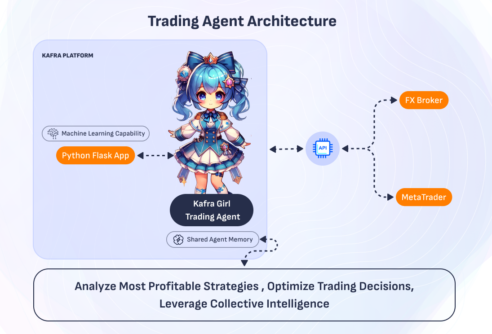

# Kafra Girl Trading Agent - Revolutionizing FOREX Trading

The Kafra Girl Trading Agent is an AI-based trading assistant tailored for the FOREX market. 
Unlike static Expert Advisors (EAs) in traditional trading, which lack decision-making adaptability, the Kafra Girl uses adaptive AI to deliver smarter, more profitable, and dynamic trading solutions.

## 

## Why FOREX?
Massive Market Size: $6 trillion daily trading volume provides immense opportunities.

- High User Demand: FOREX traders are always searching for smarter, adaptable tools.
- Limitations of Current Systems: Most traders rely on static EAs, which cannot adjust to changing market conditions.
- Potential for Mass Adoption: By solving these pain points, Kafra Girl Trading Agent can attract a large user base, ensuring the growth of both the platform and the token ecosystem.

## Key Features :

**1. Adaptive Decision-Making:**

- Uses AI to analyze real-time FOREX market conditions.
- Makes dynamic adjustments to trading strategies based on market trends, volatility, and user-defined preferences.

**2. Multi-Broker Support:**
- Supports all brokers via either API or MetaTrader integration.
- Ensures that users can trade regardless of their broker's technical limitations.

**3. User-Friendly Configuration:**

  **Plug-and-Play Setup**
 - For API brokers, users only need to provide their API key and trading account details.
 - For MetaTrader, users connect their platform using Expert Advisor.

  **Dashboard**
- Users can monitor trading activity, performance, and profit in real-time.

## Roadmap for Kafra Girl Trading Agent
Phase 1: Develop API integration for major brokers and MetaTrader compatibility.

Phase 2: Launch rental marketplace for Kafra Girls with customizable AI trading strategies.

## Tra
